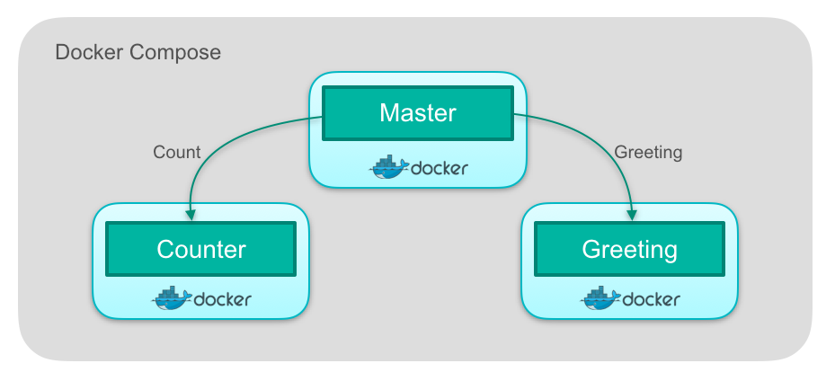

# junit-docker-demo
Demonstration of docker &amp; docker compose for integration testing of a simple distributed system (spring boot apps written in kotlin)

##Services


To build docker images for each individual service, `cd` to the service folder and run: 
```
./gradlew buildDocker
```
or simply run attached `build-docker-images.sh` shell script.

###Compose Up
To start all the services run `docker-compose up`

###URI Endpoints
- [Greeting Service](http://localhost:8081/greeting)
- [Counter Service](http://localhost:8082/counter)
- [Master Service](http://localhost:8083/info)
